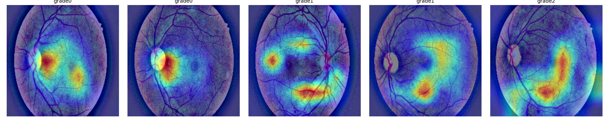
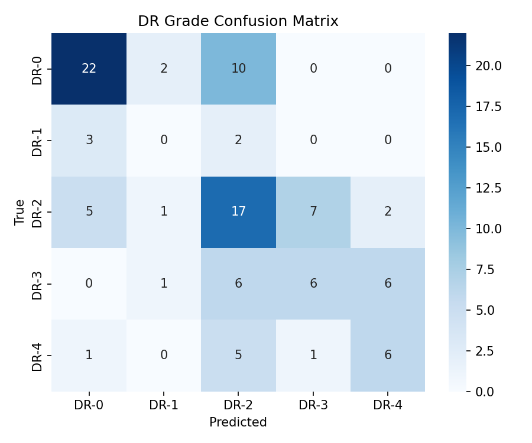
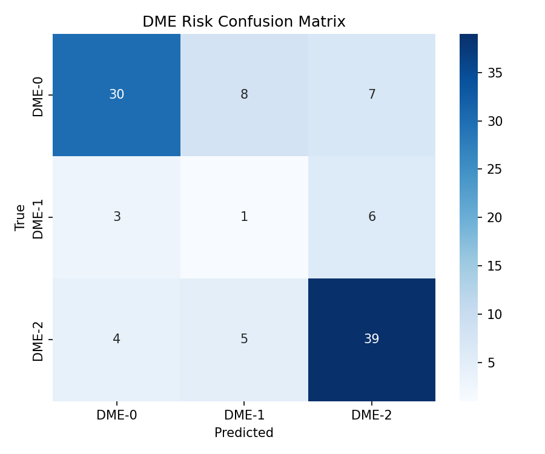
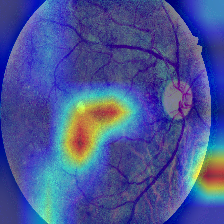

# Retinal Disease Classification with Explainable AI

Multi-label deep learning pipeline for joint Diabetic Retinopathy (DR) grading and Diabetic Macular Edema (DME) risk classification on fundus images, with Grad-CAM explainability to make predictions clinically interpretable.

 **[Live Demo →](https://retinalp1-748baprlmhnhxwhtxdgsku.streamlit.app/) | [Dataset: IDRiD →](https://idrid.grand-challenge.org/)** | | [Report →](./report/report.pdf)

<p align="center">
  
  <br>
  <em>Grad-CAM attention maps across increasing DR severity (grades 0–4). The model's attention shifts from broad retinal coverage in mild cases to focused lesion regions in severe cases.</em>
</p>

---

## Why this project

Diabetic retinopathy and diabetic macular edema are leading causes of preventable blindness worldwide, and both are typically graded together during clinical screening — yet most ML portfolio projects treat DR grading as a single-label problem. This project instead:

1. Predicts **both conditions jointly** from a single fundus image using a shared-backbone, dual-head architecture
2. Applies **fundus-specific preprocessing** (CLAHE + Ben Graham normalization) shown to meaningfully improve lesion visibility over generic image preprocessing
3. Generates **separate Grad-CAM explanations per task**, testing whether the model attends to clinically distinct regions for each pathology — a black-box model is not clinically deployable, regardless of accuracy

---

## Results

Trained on IDRiD's Disease Grading subset (413 training / 103 test images) using ResNet-50 with a shared backbone and two classification heads, 5-fold stratified cross-validation, early stopping on combined quadratic-weighted kappa.

| Task | Quadratic Weighted Kappa | Macro ROC-AUC (OvR) |
|---|---|---|
| DR Grade (5-class) | **0.657** | 0.743 |
| DME Risk (3-class) | **0.636** | 0.819 |
| **Combined (5-fold CV mean)** | **0.795 ± 0.038** | — |

<p align="center">
  
  
</p>

For context: quadratic weighted kappa is the standard metric for ordinal medical grading tasks like this because it penalizes predictions proportionally to how far off they are (predicting grade 3 when the truth is grade 4 is penalized far less than predicting grade 0), unlike raw accuracy. Published IDRiD baselines for DR-only grading typically report kappa in the 0.6–0.8 range depending on architecture and preprocessing, which places this multi-label result in a comparable, credible range while additionally solving the harder joint-task problem.

---

## Key finding: severity under-grading

Grad-CAM analysis surfaced a systematic and clinically important failure mode: the model repeatedly misclassifies severe cases (DR grade 4) as moderate (DR grade 2) rather than confusing them with adjacent grades.

<p align="center">
  
  <br>
  <em>A true grade-4 case predicted as grade-2. Grad-CAM shows attention concentrated on a subset of central lesions, with reduced sensitivity to peripheral hemorrhages that a clinician would weight heavily for severity grading.</em>
</p>

This matters beyond the accuracy number: **a model that under-grades severity is a worse clinical risk than one that over-grades it**, since under-grading could delay urgent referral. Surfacing this via Grad-CAM — rather than only reporting an aggregate kappa score — is the practical argument for why explainability isn't optional in clinical ML, not just a nice-to-have visualization layer.

---

## Architecture
​```
Input Fundus Image (224x224x3)
        |
        v
  Preprocessing: circular crop -> CLAHE (green channel) -> Ben Graham normalization
        |
        v
  ResNet-50 Backbone (ImageNet pretrained, shared)
        |
    +---+---+
    |       |
    v       v
 DR Head  DME Head
(5 classes)(3 classes)
    |       |
    v       v
Grad-CAM(DR) Grad-CAM(DME)
​```

The backbone is shared across both tasks rather than training two separate models — this reflects the clinical reality that DR and DME frequently co-occur and share underlying vascular pathology, and empirically produces a more data-efficient model given IDRiD's small size (413 training images).

---

## Explainability approach

Grad-CAM is computed independently for the DR head and DME head by wrapping the model so gradients flow only through the relevant task's output logits. This lets us test whether the two heads have learned to attend to different regions — DR lesions (microaneurysms, hemorrhages) are typically scattered across the retina, while DME is specifically a macular-region condition. Divergent attention patterns between the two heads would be evidence the shared backbone learned clinically distinct, task-specific features rather than one generic "disease" representation.

---

## Tech Stack

| Category | Tools |
|---|---|
| Deep Learning | PyTorch, torchvision, timm |
| Image Processing | OpenCV, Albumentations |
| Explainability | pytorch-grad-cam |
| Evaluation | scikit-learn |
| Demo | Streamlit |

---

## Repository Structure

```
retinal-disease-xai/
├── src/
│   ├── config.py          # paths, hyperparameters
│   ├── dataset.py         # preprocessing + Dataset class
│   ├── model.py            # multi-head architecture
│   ├── train.py            # 5-fold CV training loop
│   ├── evaluate.py         # kappa, confusion matrix, ROC-AUC
│   └── gradcam_utils.py    # dual-head Grad-CAM
├── app.py                  # Streamlit demo
├── assets/                 # result images used in this README
├── outputs/                # generated checkpoints, Grad-CAM images, logs (gitignored)
├── report/                 # 2-3 page PDF writeup
├── requirements.txt
└── README.md
```

---

## Running it yourself

```bash
git clone https://github.com/<your-username>/retinal-disease-xai.git
cd retinal-disease-xai
pip install -r requirements.txt

# Download IDRiD "Disease Grading" subset from https://idrid.grand-challenge.org/
# and place under data/raw/ — see src/config.py for expected paths

python src/dataset.py       # sanity check preprocessing
python src/train.py         # 5-fold CV training
python src/evaluate.py      # test set evaluation
python src/gradcam_utils.py # generate Grad-CAM visualizations

streamlit run app.py        # local interactive demo
```

---

## Limitations

- IDRiD's Disease Grading subset is small (413 train / 103 test), which limits how far kappa can improve without additional data or transfer learning from a larger DR dataset (e.g. APTOS or EyePACS) as pretraining
- DR grade 1 and DME grade 1 are underrepresented, and the model currently under-performs on these minority classes — addressed in ongoing work with focal loss and weighted sampling
- Grad-CAM highlights *where* the model looked, not *why* — it is a diagnostic aid for model debugging and clinician trust-building, not a substitute for a validated clinical decision-support system

---

## Citation

If referencing this work:
```
Prachi Puthran (2026). Retinal Disease Classification with Explainable AI:
Multi-Label DR and DME Grading with Grad-CAM. GitHub repository.
https://github.com/<your-username>/retinal-disease-xai
```

Dataset: Porwal, P. et al. "Indian Diabetic Retinopathy Image Dataset (IDRiD)." IEEE DataPort, 2018.
